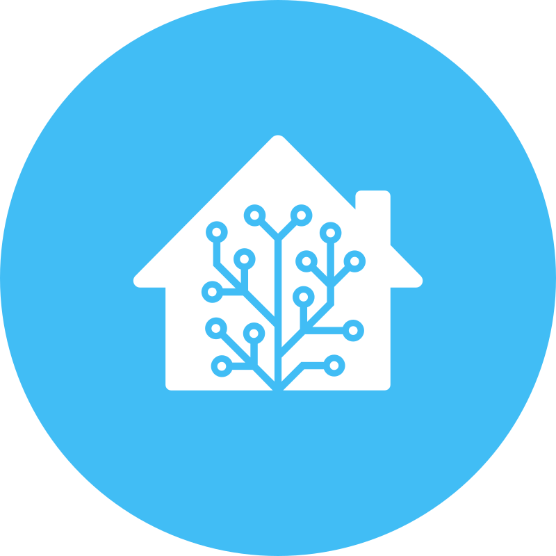
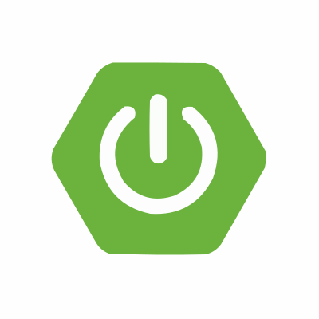

<!-- Banner -->
<header
  class="pt-1 contentcontainer"
  x-data="{ data : $store.advModal }"
  x-init="data.tryItYourself = JSON.parse(localStorage.getItem('tryItYourself')) || {
        selectedProtocol: 'HTTP',
        localaddress: 'localhost:8080',
        webdebugCheck: false,
        qrCheck: true
    };
    $watch('data.tryItYourself', function(value) {
        localStorage.setItem('tryItYourself', JSON.stringify(value));
    })"
>
  

    

      Pinggy now supports <b>multiple port forwarding</b>! <a href="/docs/http_tunnels/multi_port_forwarding/" target="_blank">Learn more.</a> 🤯
    

    

      

        

          <h1 class="display-5 fw-bolder biggestheader d-inline">
            Public URLs for Localhost.
          </h1>
          Without downloading any binary!
          

            Create HTTP, TCP, UDP, or TLS tunnels to your Mac/PC. Even if it is
            sitting behind firewalls and NATs.
          

          

            

              &nbspFree persistent URL&nbsp; for
              7 days & custom domain support:
            

            

              <input
                type="email"
                class="form-control"
                placeholder="Email"
                aria-label="Email"
                aria-describedby="button-addon2"
                id="trialemail"
              />
              

                Please enter a valid email
              

              <button
                style="
                  border-color: rgb(71, 117, 198);
                  background-color: rgba(70, 117, 199, 1);
                  padding: 0.6em 1em;
                  box-shadow: 0 0 4px 0px #a3599b8c;
                  font-weight: 500;
                "
                class="btn btn-secondary"
                type="button"
                id="button-addon2"
                onclick="starttrial()"
              >
                Start 7 days free trial
              </button>
            

            <button onclick="trynow()" id="trynow">
              Or just try it for free →
            </button>
          

        

      

      

        

          

            <h2 class="h5 mt-3">Configure your free tunnel</h2>
            <form class="mt-3">
              <label for="localaddress" class="text-bold"
                ><strong>Your local address:</strong></label
              >
              

                

                  <select
                    class="form-select"
                    id="protocolSelect"
                    x-model="data.tryItYourself.selectedProtocol"
                    aria-label="Select protocol"
                  >
                    <option value="HTTP">HTTP</option>
                    <option value="TCP">TCP</option>
                    <option value="UDP">UDP</option>
                  </select>
                

                <input
                  class="form-control"
                  id="localaddress"
                  type="text"
                  :placeholder="data.tryItYourself.localaddress || 'localhost:8000'"
                  x-model="data.tryItYourself.localaddress"
                  aria-label="Local address"
                />
              

            </form>
            

              

                <label class="switch" aria-label="Web Debugger">
                  <input
                    type="checkbox"
                    id="webdebuggerinput"
                    x-model="data.tryItYourself.webdebugCheck"
                  />
                  
                </label>
                
                  Web Debugger
                
              

              

                <label class="switch" aria-label="QR Code">
                  <input
                    type="checkbox"
                    id="qrinput"
                    x-model="data.tryItYourself.qrCheck"
                  />
                  
                </label>
                QR Code
                  <i
                    class="bi bi-info-circle"
                    data-bs-toggle="tooltip"
                    data-bs-placement="right"
                    data-bs-html="true"
                    title="Show QR Code for the URL"
                  >
                  </i>
                
              

            

            

              A simple warning alert—check it out!
            

          

          

            <label class="text-bold mt-2" x-show="data.tryItYourself.selectedProtocol == 'UDP'">
              <strong>First Download the <a target="_blank" href="/cli/">Pinggy CLI</a></strong> 
            </label>
            <label class="text-bold mt-2"
              ><strong>Paste this command to start tunnel:</strong></label
            >
            

              <textarea
                id="portcommand"
                class="form-control"
                aria-label="Command to start tunnel"
                readonly="readonly"
                x-text="$store.advModal.tryItYourselfCommand()"
              ></textarea>
              <button
                class="btn btn-dark"
                type="button"
                id="copybutton_tryityourselfcommand"
                aria-label="Copy SSH URL to Clipboard"
                onclick="copytoclipboard(this,'#portcommand')"
              >
                <i class="bi bi-clipboard"></i>
              </button>
            

            

              Enter "yes" to continue connecting. Enter blank password if
              prompted.
            

            

              Default Web Debugger URL:
              <a href="http://localhost:4300" target="_blank"
                >http://localhost:4300</a
              >
            

            

            <button
              type="button"
              class="ml-1 btn btn-light text-decoration-none float-end border"
              data-bs-toggle="modal"
              data-bs-target="#advancedModal"
              id="advancedModalButton"
            >
              <i class="bi bi-gear"></i> Advanced Settings
              <i class="bi bi-chevron-right" style="font-size: 0.8rem"></i>
            </button>
            <a
              href="/docs/"
              target="_blank"
              type="button"
              class="mx-1 btn btn-light text-decoration-none float-end border"
            >
              <i class="bi bi-file-text"></i> Docs
              <i class="bi bi-chevron-right" style="font-size: 0.8rem"></i>
            </a>
            

          

        

      

    

  

</header>
<!-- Modal -->

    

        

            

                Advanced Tunnel Configuration
                <button type="button" class="btn-close" data-bs-dismiss="modal" aria-label="Close"></button>
            

            

                
                
            

        

    

<!-- Features -->

  

    

      <h2 class="mb-5 text-left fw-light">
        Quickest way to 
      </h2>
    

  

<!-- Features section-->
<section id="features">
  

    

      

        
        
        
        
        
        
        
        
        
        
        
        
        
        
        
        
        
        
        
        
        
        
        
        
        
        
        
        
        
        
        
        
        
        
        
        
        
        
        
        
        
        
        
        
        
        
        
        
        
        
        
      

    

  

</section>

<section class="pt-5" id="features">
  

    

      

        

          <video
            preload="none"
            onclick="if(this.paused && !this.controls){ this.controls=true; this.play() }"
            poster="/assets/tunnelvideothumb.webp"
          >
            <source src="/assets/pinggy_demo.webm" type="video/webm" />
            Your browser does not support HTML video.
          </video>
        

      

      

        

          <i class="bi bi-collection"></i>
        

        <h2 class="h3 fw-bolder">Share your websites and apps in seconds!</h2>
        <ul class="list-unstyled text-muted">
          <li class="my-3">
            <i class="bi bi-check2-circle me-2"></i> Skip uploading to cloud
          </li>
          <li class="my-3">
            <i class="bi bi-check2-circle me-2"></i> No need to download any
            tool
          </li>
          <li class="my-3">
            <i class="bi bi-check2-circle me-2"></i> Link your own domain
          </li>
          <li class="my-3">
            <i class="bi bi-check2-circle me-2"></i> Basic Authentication
          </li>
        </ul>
        <a href="/quickstart/"
          ><button
            class="btn btn-primary me-2"
            style="background-color: rgba(70, 117, 199, 1)"
          >
            Quickstart
          </button></a
        >
        <a class="text-decoration-none pinggy-link" href="/docs/http_tunnels/">
          Learn more
          <i class="bi bi-arrow-up-right-square"></i>
        </a>
      

    

  

</section>

<section class="pt-5 mt-5" id="features">
  

    

      

        

          <i class="bi bi-bug"></i>
        

        <h2 class="h3 fw-bolder">Debug on the go!</h2>
        <ul class="list-unstyled text-muted">
          <li class="my-3">
            <i class="bi bi-check2-circle me-2"></i> Debug HTTP / HTTPS requests
            live
          </li>
          <li class="my-3">
            <i class="bi bi-check2-circle me-2"></i> No need to download any
            tool
          </li>
          <li class="my-3">
            <i class="bi bi-check2-circle me-2"></i> Replay requests
          </li>
        </ul>
        <a class="text-decoration-none pinggy-link" href="/docs/http_tunnels/">
          Learn more
          <i class="bi bi-arrow-up-right-square"></i>
        </a>
      

      

        
      

    

  

</section>

<section class="pt-5 mt-5" id="features">
  

    

      

        

          

            

              
            

            

              
            

          

          <button
            class="carousel-control-prev"
            type="button"
            data-bs-target="#carouselTUI"
            data-bs-slide="prev"
          >
            
            Previous
          </button>
          <button
            class="carousel-control-next"
            type="button"
            data-bs-target="#carouselTUI"
            data-bs-slide="next"
          >
            
            Next
          </button>
        

      

      

        

          <i class="bi bi-terminal"></i>
        

        <h2 class="h3 fw-bolder">Rich Terminal Interface</h2>
        <ul class="list-unstyled text-muted">
          <li class="my-3">
            <i class="bi bi-check2-circle me-2"></i> Live request logs
          </li>
          <li class="my-3">
            <i class="bi bi-check2-circle me-2"></i> View request / response
            headers
          </li>
          <li class="my-3">
            <i class="bi bi-check2-circle me-2"></i> Stats on bandwidth and more
          </li>
        </ul>
        <a class="text-decoration-none pinggy-link" href="/docs/http_tunnels/">
          Learn more
          <i class="bi bi-arrow-up-right-square"></i>
        </a>
      

    

  

</section>

<!-- Features section-->
<section class="py-5 border-bottom" id="features">
  

    

      

        <h2 class="text-center fw-light">
          Secure tunnels to your private network.
        </h2>
      

    

    

      

        
      

    

  

</section>

<!-- App / CLI section-->
<section class="border-bottom" id="appcli">
  

    

      

        <h2 class="text-center">
          Easy to use apps
        </h2>
      

    

    

      

        <h2 class="h3 fw-bolder mt-3">Desktop App</h2>
        <ul class="list-unstyled text-muted">
          <li class="my-3">
            <i class="bi bi-check2-circle me-2"></i> Available for Windows, Mac, and Linux
          </li>
          <li class="my-3">
            <i class="bi bi-check2-circle me-2"></i> Easy to use GUI to manage your tunnels
          </li>
          <li class="my-3">
            <i class="bi bi-check2-circle me-2"></i> Auto start tunnels on boot
          </li>
        </ul>
        <a class="text-decoration-none pinggy-link" href="/app/">
          Learn more
          <i class="bi bi-arrow-up-right-square"></i>
        </a>
        <h2 class="h3 fw-bolder mt-5">Command Line App</h2>
        <ul class="list-unstyled text-muted">
          <li class="my-3">
            <i class="bi bi-check2-circle me-2"></i> Robust auto reconnection
          </li>
          <li class="my-3">
            <i class="bi bi-check2-circle me-2"></i> JSON configuration
          </li>
        </ul>
        <a class="text-decoration-none pinggy-link" href="/cli/">
          Learn more
          <i class="bi bi-arrow-up-right-square"></i>
        </a>
      

      

      
      

    

  

</section>

<!-- Features section-->
<section class="py-5 border-bottom" id="features">
  

    

      

        <h2 class="mb-5 text-center">Features</h2>
      

    

    

      

        

          

            <i class="bi bi-window-stack"></i>
          

          <h2 class="h3 fw-bolder">No downloads</h2>
          <h2 class="h6 fw-light">Runs everywhere</h2>
          

            <i class="bi bi-check2-circle me-2"></i><b>Windows</b>  <i
              class="bi bi-check2-circle me-2"
            ></i
            ><b>Mac</b>  <i class="bi bi-check2-circle me-2"></i
            ><b>Linux</b> 
            <i class="bi bi-check2-circle me-2"></i><b>Docker</b>
          

        

      

      

        

          

            <i class="bi bi-hdd-network"></i>
          

          <h2 class="h3 fw-bolder">Multiple Protocols</h2>
          

            <i class="bi bi-check2-circle me-2"></i><b>HTTPS</b> tunnels with
            built-in Let's Encrypt certificates for web applications.  <i
              class="bi bi-check2-circle me-2"
            ></i
            ><b>TCP</b> tunnels for other applications.  
            <i
              class="bi bi-check2-circle me-2"
            ></i
            ><b>UDP</b> tunnels. <i
              class="bi bi-check2-circle me-2"
            ></i
            ><b>TLS</b> tunnels for end-to-end encryption.
          

        

      

      

        

          

            <i class="bi bi-link-45deg"></i>
          

          <h2 class="h3 fw-bolder">Instant Domains</h2>
          

            <i class="bi bi-check2-circle me-2"></i><b>Subdomain</b>: Custom persistent subdomains.  <i
              class="bi bi-check2-circle me-2"
            ></i
            ><b>Custom domain</b>: Bring your own domains with built-in HTTPS
            certificates. 
            <i class="bi bi-check2-circle me-2"></i>
            <b>Wildcard domains</b>: Use <code>*.yourdomain.com</code> to route different subdomains to different ports.
          

        

      

      

        

          

            <i class="bi bi-shield-lock"></i>
          

          <h2 class="h3 fw-bolder">Access Control</h2>
          

            <i class="bi bi-check2-circle me-2"></i
            ><b>Password</b> authentication with HTTP Basic authentication.
             <i class="bi bi-check2-circle me-2"></i><b>Bearer token</b> /
            key based authentication.  <i
              class="bi bi-check2-circle me-2"
            ></i
            ><b>IP whitelisting</b> for restricted access.
          

        

      

      

        

          

            <i class="bi bi-bug"></i>
          

          <h2 class="h3 fw-bolder">Inspect & Debug</h2>
          

            <i class="bi bi-check2-circle me-2"></i><b>Live debugger</b>:
            Inspect HTTP requests on the fly. View requests, responses, headers,
            etc.  <i class="bi bi-check2-circle me-2"></i
            ><b>Header manipulation</b>: Change HTTP request headers before they
            arrive at your server.
          

        

      

      

        

          

            <i class="bi bi-globe-americas"></i>
          

          <h2 class="h3 fw-bolder">Multiple Regions</h2>
          <h2 class="h4 fw-light">Fast Tunnels</h2>
          

            

              

                

                  <i class="bi bi-check2-circle me-2"></i><b>USA</b>  
                  <i class="bi bi-check2-circle me-2"></i><b>Europe</b>  
                  <i class="bi bi-check2-circle me-2"></i><b>Asia</b>
                

              

              

                

                  <i class="bi bi-check2-circle me-2"></i><b>Brazil</b>  
                  <i class="bi bi-check2-circle me-2"></i><b>Australia</b>
                

              

            

          

        

      

    

  

</section>

<header class="bg-light py-5" id="prices" x-init="$store.location.detectCountry()">
  

    

      <!-- Begin Page Content -->
      

        

          <h1 class="text-bold fw-normal">
            Subscribe to the easiest localhost tunneling.
          </h1>
          

            Make your developement experience smoother by unlocking the full
            potential of Pinggy.
          

        

        <main>
          

            

              <label
                class="toggler toggler--is-active align-middle"
                id="filt-monthly"
                >Monthly</label
              >
              <label
                class="switch"
                aria-label="Toggle between monthly and yearly plans"
              >
                <input id="toggleswitch" type="checkbox" checked="" />
                
              </label>
              <label class="toggler align-middle" id="filt-hourly">Yearly</label
              >
                (Save upto 17%)
            

          

          

            

              

                

                  <h4 class="my-0 fw-normal">Free</h4>
                

                

                  

                    <h1 class="card-title pricing-card-title">
                       0<small class="text-muted fw-light">/month</small>
                    </h1>
                    Free for life
                  

                  <ul class="list-unstyled mt-3 mb-4 list-group text-left">
                    <li class="list-group-item p-2">
                      Single command tunneling
                    </li>
                    <li class="list-group-item p-2">
                      HTTP(S), TCP, UDP, TLS tunnels
                    </li>
                    <li class="list-group-item p-2">
                      Live header manipulation
                    </li>
                    <li class="list-group-item p-2">
                      Request-response inspection & replays
                    </li>
                    <li class="list-group-item p-2">
                      <b>60 minutes tunnel timeout</b>
                    </li>
                    <li class="list-group-item p-2">Random subdomains</li>
                    <li class="list-group-item p-2">
                      Restricted bandwidth and connections
                    </li>
                  </ul>
                  <a class="mt-auto" href="https://dashboard.pinggy.io/"
                    ><button
                      type="button"
                      class="w-100 btn btn-lg btn-outline-pinggy"
                    >
                      Go to dashboard
                    </button></a
                  >
                

              

            

            

              

                

                  <h4 class="my-0 fw-normal">Pro</h4>
                

                

                  

                    

                      
                        <button
                          @click="seatVal = Math.max(1, parseInt(seatVal) - 1)"
                          class="btn btn-outline-dark"
                        >
                          -
                        </button>
                      
                      <input
                        type="number"
                        x-model="seatVal"
                        class="form-control text-center"
                        aria-label="Number of seats"
                        x-on:input="seatVal = isNaN(parseFloat(seatVal)) 
                                                    || seatVal < 1 ? 1 : seatVal"
                      />
                      
                        <button
                          @click="seatVal = parseInt(seatVal) + 1"
                          class="btn btn-outline-dark"
                        >
                          +
                        </button>
                      
                    

                    Seats
                  

                  

                    <h1 class="card-title pricing-card-title">
                       <small class="text-muted fw-light">/month</small>
                    </h1>
                    (billed annually)
                  

                  

                    <h1 class="card-title pricing-card-title">
                       <small class="text-muted fw-light">/month</small>
                    </h1>
                    (billed monthly)
                  

                  <template x-if="seatVal > 20">
                    

                      <a href="/contact_us/" target="_blank"><b>Contact us</b></a> to get volume discounts!
                    

                  </template>
                  <ul class="list-unstyled mt-3 mb-4 text-left list-group">
                    <li class="list-group-item p-2 bg-light">
                      Everything in Free plan
                    </li>
                    <li class="list-group-item p-2">
                      <b
                        > Persistent tunnel 1"
                          >s</b
                      >
                    </li>
                    <li class="list-group-item p-2">
                      <b
                        > Custom subdomain 1"
                          >s</b
                      >
                    </li>
                    <li class="list-group-item p-2">
                      <b
                        > Custom domain 1"
                          >s</b
                      >
                    </li>
                    <li class="list-group-item p-2">
                      <b
                        > Persistent TCP/UDP port 1"
                          >s</b
                      >
                    </li>
                    <li class="list-group-item p-2">
                      <b
                        > Team 1"
                          >s</b
                      > <a href="/docs/teams/" target="_blank" class="link-dark">
                          <i class="bi bi-info-circle"></i>
                        </a>
                    </li>
                    <li class="list-group-item p-2">
                      Remote Device Management
                    </li>
                    <li class="list-group-item p-2">
                      <b>Wildcard Domain Support</b>
                    </li>
                    <li class="list-group-item p-2">
                      <b>Unlimited Data Transfer</b>
                    </li>
                    <li class="list-group-item p-2">
                      Priority mail / Discord support
                    </li>
                  </ul>
                  <a
                    x-show="seatVal > 1"
                    class="mt-auto w-100 btn btn-lg btn-pinggy"
                    id="checkout-and-portal-button"
                    href="https://dashboard.pinggy.io"
                    >Get Started</a
                  >
                  <button
                    x-show="seatVal == 1"
                    type="button"
                    class="mt-auto w-100 btn btn-lg btn-pinggy"
                    data-bs-toggle="modal"
                    data-bs-target="#trialModal"
                    id="trialModalButton"
                  >
                    Start 7 Days Free Trial
                  </button>
                

              

            

            

              

                

                  <h4 class="my-0 fw-normal">Enterprise</h4>
                

                

                  

                    <a
                      href="/contact_us/"
                      class="text-decoration-none text-dark"
                    >
                      <h1 class="card-title pricing-card-title">Contact Us</h1>
                    </a>
                    contact@pinggy.io
                  

                  <ul class="list-unstyled mt-3 mb-4 list-group text-left">
                    <li class="list-group-item p-2 bg-light">
                      <b>Dedicated Servers</b> / On Premise
                    </li>
                    <li class="list-group-item p-2">
                      <b>Unlimited persistent tunnels</b>
                    </li>
                    <li class="list-group-item p-2">
                      <b>Unlimited custom subdomains</b>
                    </li>
                    <li class="list-group-item p-2">
                      <b>Unlimited custom domains</b>
                    </li>
                    <li class="list-group-item p-2">
                      <b>Unlimited persistent TCP/UDP ports</b>
                    </li>
                    <li class="list-group-item p-2">
                      <b>Unlimited Teams</b>
                        <a href="/docs/teams/" target="_blank" class="link-dark">
                          <i class="bi bi-info-circle"></i>
                        </a>
                    </li>
                    <li class="list-group-item p-2">
                      <b>API to monitor and manage tunnels</b>
                        <a href="/docs/api/api/" target="_blank" class="link-dark">
                          <i class="bi bi-info-circle"></i>
                        </a>
                    </li>
                    <li class="list-group-item p-2">Priority Discord & Call Support</li>
                  </ul>
                  <a
                    class="mt-auto w-100 btn btn-lg btn-pinggy"
                    id="checkout-and-portal-button-1"
                    href="/contact_us/"
                    >Contact Us</a
                  >
                

              

            

          

        </main>
      

    

  

</header>
<!-- Trial Modal -->

  

      

          

              Start 7 Days Free Trial
              <button type="button" class="btn-close" data-bs-dismiss="modal" aria-label="Close"></button>
          

          

            

              

                Free Pinggy Pro for
                7 days:
              

              

                <input
                  type="email"
                  class="form-control"
                  placeholder="Email"
                  aria-label="Email"
                  aria-describedby="button-addon2"
                  id="trialemail2"
                />
                

                  Please enter a valid email
                

                <button
                  style="
                    border-color: rgb(71, 117, 198);
                    background-color: rgba(70, 117, 199, 1);
                    padding: 0.6em 1em;
                    box-shadow: 0 0 4px 0px #a3599b8c;
                    font-weight: 500;
                  "
                  class="btn btn-secondary"
                  type="button"
                  id="button-addon2"
                  onclick="starttrial2()"
                >
                  Start Trial
                </button>
              

            

          

      

  


